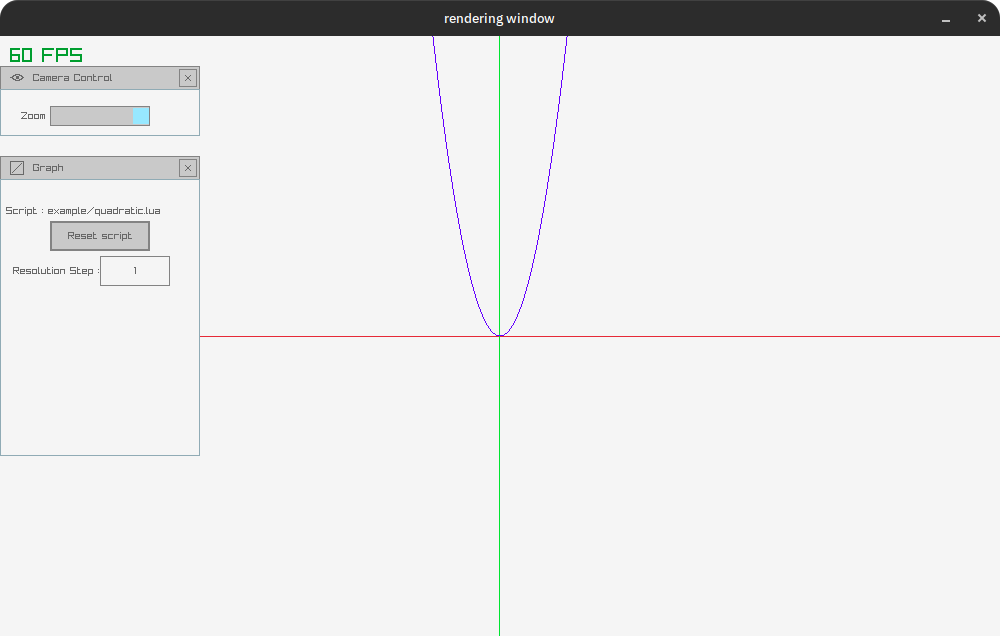

# Simple Graph Rendering Program
A simple graph Rendering program written in [go](https://go.dev/) using [raylib](https://www.raylib.com/) as a rendering engine.


**Features:**
1. Support lua scripting.

**Todo :**
- [x] Rendering graph
- [x] Lua scripting
- [ ] Support multiple graph
- [ ] Rewrite a rendering engine

## Build
You need to install a dependencies of raylib. Please follow the installation requirements of [raylib-go](https://github.com/gen2brain/raylib-go) [here](https://github.com/gen2brain/raylib-go/tree/master?tab=readme-ov-file#requirements).

To build a project uses `go`.
```bash
go build ./
```

## Usage
```sh
penrenderingmethod [script path]
```

## Lua scripting
```lua
-- Uses for initialize varible.
function load()
  -- run when script is loaded.
  return {R=255, G=0, B=0}
end

-- Uses for render a graph.
-- x is a x coordination in a graph space.
function render(x)
  -- run each frame.
end
```